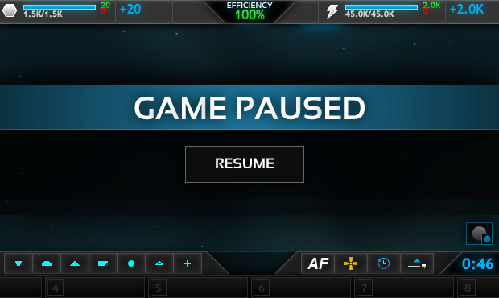
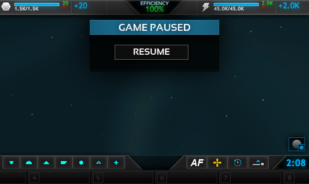

# Small Pause #
A Planetary Annihilation UI Mod

## Description ##
This is a modification for the popular real-time strategy game: Planetary Annihilation. It makes the pause dialogue and button much smaller so it doesn't get in the way of the rest of the interface while the game is paused. This is useful for modders who want to test their UI while the game is paused.

#### Before: ####

#### After: ####

## Installation ##
If you just want to use the mod, don't bother downloading the code from GitHub. Follow these steps:

- Install [PA Mod Manager (PAMM)](https://forums.uberent.com/threads/rel-pa-mod-manager-cross-platform.59992/)
- Run PAMM
- Click on the "Available Mods" section
- Type "small pause" in the search box
- Find the "Small Pause Button" item and click the "install" link

## Contributing ##
If you would like contribute, send a pull request. Just don't send me tabs. I hate tabs.

To get the mod working from the source code, follow these steps:
- Clone the github repository somewhere
- Copy the `com.pa.coldboot.smallpause` directory to this directory:
  * Mac OS: `~/Library/Application Support/Uber Entertainment/Planetary Annihilation/client_mods/`
- Run PAMM
- Click on the "UI Mods" section
- Find the "Small Pause Dialogue" and click it to activate it

## Forum Discussion ##
The discussion is at [[REL] [CLIENT] Small Pause Dialogue](https://forums.uberent.com/threads/rel-client-small-pause-dialogue.68689/) at the Planetary Annihilation forums.
